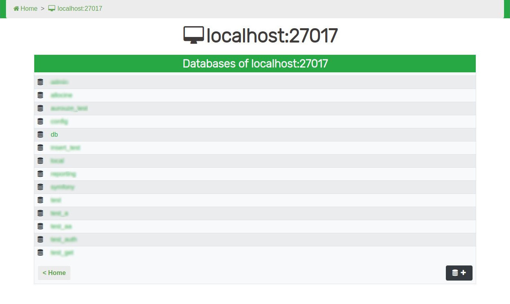
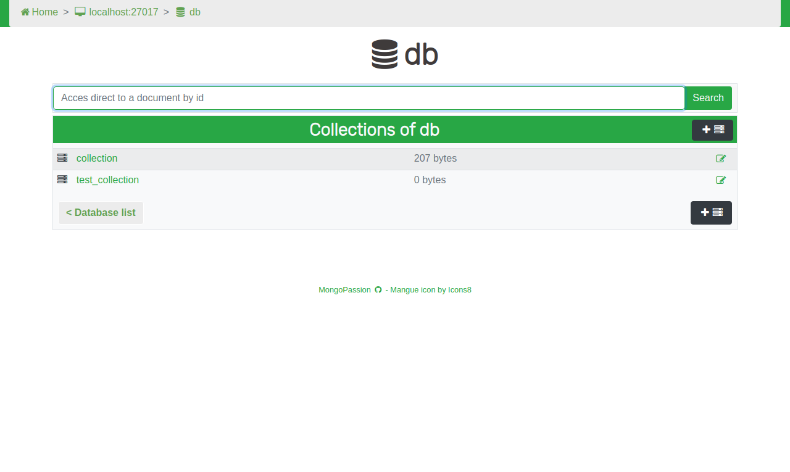
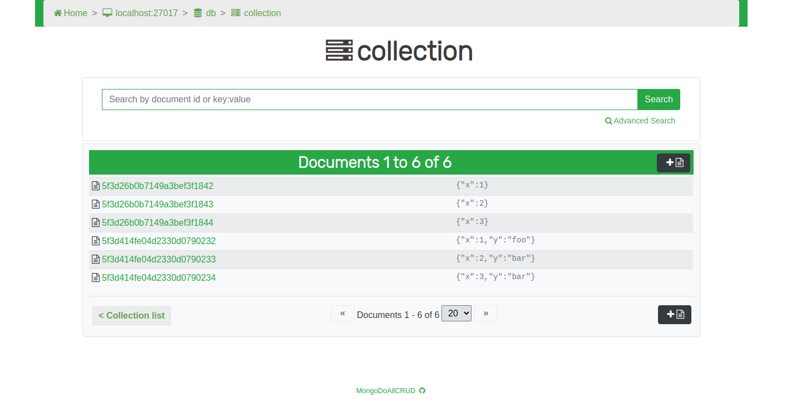

***<h1 align="center">MongoPassion</h1>***

Web-based project for management of MongoDB databases

_Read in other languages: [Français](README.md), [English](README.en.md)_

# Aperçu de l'application

- MongoPassion allows you to connect to MongoDB, by authenticating if necessary.

<!--    -->

- The app's main functionality is to allow to dilay and to modify every database, collection or document on your server.

- The project also offers two edition mode for documents : a basic json mode on one side and the possibility of using the jsoneditor tool on the other.

- MongoPassion offers in addition several ways to search documents : a search using the ID from a database, another using ID or content from a collection and finally a freer one, in the form of a console, directly in Javascript.

# Installation

## Prerequesites
- PHP 7-*  
- Apache2

## Installation of the php-mongodb package
    $ sudo pecl mongodb

## GitHub Repository
 - Clone the repository in /var/wwww/html  
 - Cd into the project folder (MongoPassion)
 
# In case of a missing package
 
## Manual installation of Mongo dependencies with Composer : 
    $ composer require mongodb/mongodb

## Manual installation of JsonEditor with npm :
 - Cd into the MongoPassion directory
 - Clone jsoneditor files from GitHub :
 
       $  git clone https://github.com/josdejong/jsoneditor.git
 - Install jsoneditor :
    
       $  npm install jsoneditor
 - Cd into the jsoneditor folder, copy the package.json file then paste it in the MongoPassion directory
 - Cd into the MongoPassion directory
 - Continue with the installation :
            
       $  npm install
       
 - Move the node_modules folder and package.json and package-lock.json files in the jsoneditor folder
 - Cd into the jsoneditor folder
 - Complete the installation :
 
       $  npm run build

