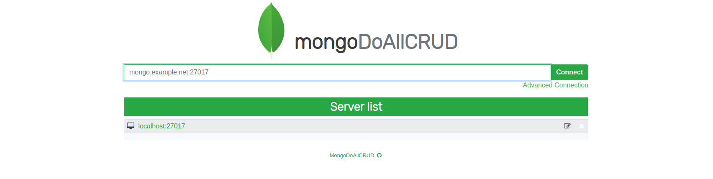

***<h1 align="center">Interface-MongoDB</h1>***

Application web de gestion de bases de données MongoDb (NoSQL)

_Lire en d'autres langues: [Français](README.md), [English](README.en.md)_

# Aperçu de l'application

- 

 

# Installation

## Prérequis
- PHP 7-*  
- Apache2

## Installation du package php-mongodb
    $ sudo pecl mongodb

## Dépôt Git
 - Clônez le projet dans /var/wwww/html  
 - Placez-vous dans le dossier du projet (Interface-MongoDB)
 
# En cas de package manquants
 
## Installation manuelle des dépendances Mongo avec Composer : 
    $ composer require mongodb/mongodb

## Installation manuelle de JsonEditor avec npm :
 - Placez vous dans le répertoire Interface-MongoDB
 - Clonez les fichiers à partir du git :
 
       $  git clone https://github.com/josdejong/jsoneditor.git
 - Installez jsoneditor :
    
       $  npm install jsoneditor
 - Placez-vous dans le dossier jsoneditor, copiez le fichier package.json puis collez le dans le dossier Interface-MongoDB
 - Placez-vous dans le dossier Interface-MongoDB
 - Poursuivez l'installation :
            
       $  npm install
       
 - Déplacez le dossier node_modules et les fichiers package.json et package-lock.json dans le dossier jsoneditor
 - Placez vous dans le dossier jsoneditor
 - Finalisez l'installation :
 
       $  npm run build

